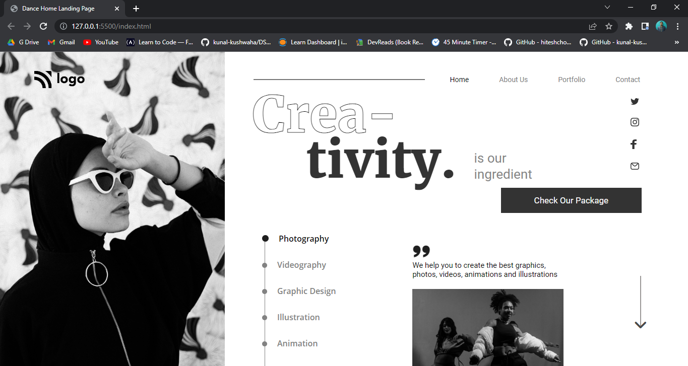

# Dance Home Landing Page

Hi 👋 I am Shobhan Sundar Goutam. This project is made with the help of `HTML` and `CSS`.

 

- ### Learnings from this project:-

  - Learned to use properties like `-webkit-text-fill-color` and `-webkit-text-stroke-width`.
  - Learned to make a roadmap with dots over line using css.
  - Learned to use other css properties for creating responsivenss of the website.

- It took around _7 hours_ to complete.

- Live Link:- [Dance Home Landing Page](https://dancehosting-fsjs14.netlify.app/)

### Screenshot

